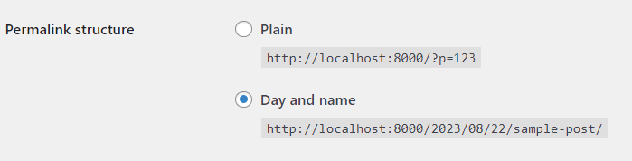
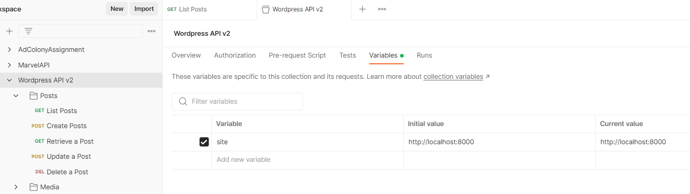
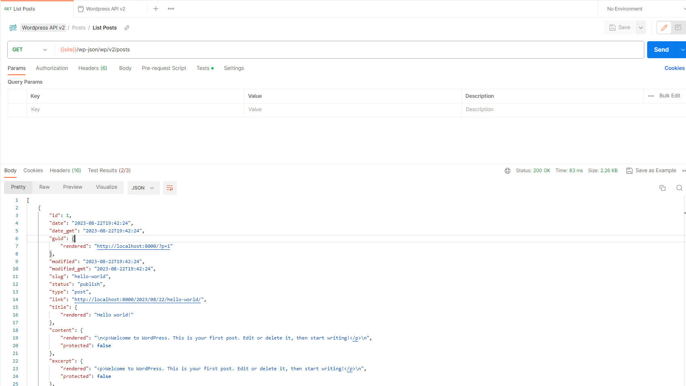

# next-and-wordpress

Experiment with combining headless WordPress with Next.js as frontend

## Setup and requirements

We need Docker to run the WordPress instance.

1. Run Docker Compose in the main directory
```
docker-compose up
```

2. Configure WordPress - just go through the setup, choose language etc.

3. Change permalink settings (to avoid issue with REST API)



4. Get Postman - https://www.postman.com/downloads/

5. Import Postman collection from `postman-collection`

6. Add variable to collection - site:http://localhost:8000



7. Run list posts request to verify connectivity with WordPress REST API
